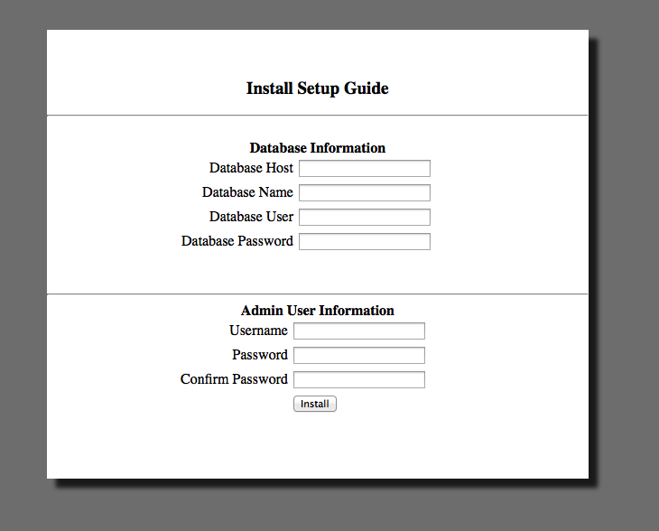
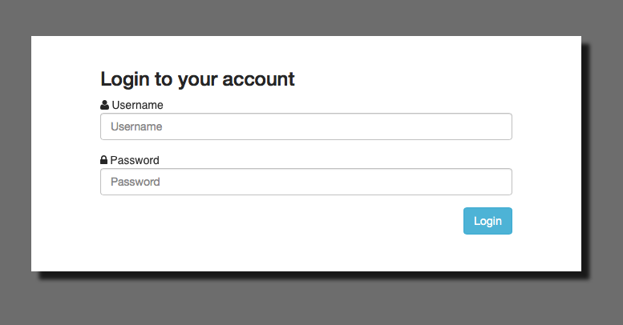

Simple AR
=========

This application is a very basic Accounts Receivable tracking system.  It is designed to track customers, their locations, deposits, and full payments of an invoice.

This is a weekend project, so please use at your own risk.  Enjoy. 

Installation 
=============
Requirements: Web server running PHP 5.4 and a MySQL or Maria database.

Install: Simply upload to webserver, create database and visit the index page in your browser.  It will prompt you to enter database information and create an admin user.  It will automatically create the necessary database tables for you.  

Screen Shots
============

